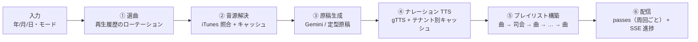

# 📻 Retro Radio Time Machine（レトロラジオ・タイムマシン）v2.0.0

<div align="center">


**1950年〜2025年の昭和・平成・令和を、その年のニュースとヒット曲でたどる AI ラジオ番組生成サービス。**

**【介護デイサービスの回想法レク】** ・ **【誕生日・記念日ギフト】** ・ **【個人鑑賞のタイムマシン】**

</div>

---

## 🎯 このリポジトリは

指定した年月日のラジオ番組を生成し、**原稿（ナレーションの音声）** と **当時のヒット曲のプレビュー** を連続再生できる Web アプリです。

- **フロントエンド**: Vanilla HTML5 / CSS / JavaScript の Single Page Application（ビルド不要・フレームワークなし）
- **バックエンド**: FastAPI + gTTS + Gemini API
- **音声合成**: gTTS（日本語 / `co.jp`）
- **API キー**: 環境変数のみで管理。ブラウザからキーを入力・保存する画面は**存在しません**

> **Streamlit は完全に廃止されました。** 旧 UI 層（`retro_radio/ui/`）、i18n 重複層、`progressive_loading.py` などは削除済みです。起動は必ず `uvicorn` 経由で行ってください。

---

## 📸 機能のスナップショット

### 一行で言うと

> 年と日付を指定すると、AI が当時の原稿（ナレーション）を書き、gTTS で音声にし、
> 当時のヒット曲（iTunes プレビュー）と交互に再生します。

### 今できることの全体像

| 領域 | 機能のスナップショット | 実装場所 |
|---|---|---|
| **番組生成** | 年/月/日 + モードを指定 → 原稿・音声・選曲・プレイリストを返す | [`retro_radio/server.py`](retro_radio/server.py) |
| **3 つの放送モード** | タイムマシン / デイサービス回想法 / 記念日・誕生日ギフト | `core/fallback.py` |
| **原稿生成** | Gemini で原稿 → 未設定時は**定型原稿**へ自動フォールバック（起動を妨げない） | `core/script_generator.py` |
| **ナレーション音声** | gTTS（日本語 `co.jp`）→ 429 時は旧エンドポイントへ自動切替 | `server.py` / `core/legacy_tts.py` |
| **ヒット曲** | 正本カタログ → iTunes で音源照合。**音源が取れない歌曲は司会にも番組表にも出さない** | `core/preview_resolver.py` |
| **選曲ローテーション** | 再生履歴を見て、連続する放送どうしで曲が重複しにくい順に選ぶ | `core/song_selector.py` |
| **番組表** | 当日の時系列番組表（地域局・番組名・開始時刻） | `core/fallback.py` |
| **回想法クイズ** | 「思い出クイズ＆会話のタネ」を出力（回想法モードのみ） | `core/fallback.py` |
| **事実レジストリ** | 年ごとに「その年に起きた事」を出典付きで管理。検証スクリプトが検査 | [`docs/facts_registry.md`](docs/facts_registry.md) |
| **進捗表示** | 非同期ジョブ + SSE で 4 段階の進捗をライブ表示、途中で**中止**も可能 | [`docs/jobs_and_progress.md`](docs/jobs_and_progress.md) |
| **再生（フロント）** | 自動クロスフェード / 無音の溝を作らない間奏 / シーク / 速度変更 0.9〜1.15 | [`static/app.js`](static/app.js) |
| **回想法レク運用** | 原稿用紙の縦書き切替・**A4 印刷レイアウト**・クイズ印刷 | [`docs/state_design_system.md`](docs/state_design_system.md) |
| **シニア対応** | 特大表示トグル（文字・操作対象を拡大） | `static/index.html` |
| **オフライン対応** | Service Worker でオフラインでも起動可。API 通信は常にネットワーク直行 | `static/service-worker.js` |
| **認証** | メール + パスワード or ベアラートークン → HttpOnly セッション Cookie | [`docs/privacy_and_tenancy.md`](docs/privacy_and_tenancy.md) |
| **同意・開示・削除** | 同意記録 / データエクスポート（JSON・CSV）/ 自分のデータ削除 | `api/me.py` |
| **テナント分離** | 認証有効時は TTS キャッシュも URL もテナントごとに物理分離 | `services/tenant_cache.py` |
| **監査ログ** | 生成の開始・終了を**必ず 2 行**記録（原稿本文は記録しない） | `api/audit.py` |
| **PWA** | manifest + Service Worker + オフライン時のフォールバック画面 | `static/manifest.json` |

### 現在のコードベース規模

| 指標 | 実測値 |
|---|---|
| API | **26 オペレーション**（21 パス。OpenAPI 定義数） |
| テスト | **2,890 件**（91 ファイル。`network` マーカー 3 件は既定で除外） |
| 曲カタログ | **3,030 曲 / 74 年**（1950〜2025） |
| 事実レコード | **17 件** |
| バックエンド | Python 3.11 / 3.12 / 3.13 |
| フロントエンド | ビルド不要の Vanilla HTML5 / CSS / JS（フレームワークなし） |

> 曲数などの数値は**固定せず**、正本・検証コマンドを参照してください（「曲カタログの充足状況」参照）。

---

## 🔄 1 回の番組生成フロー



**この順序が重要な理由**: 音源解決を原稿生成より**前**に置いています。司会が「次は ○○ です」と紹介しながら実際は無音で流れる（歯抜け）と、ラジオ番組として破綻するためです。**実際に鳴る曲だけ**を原稿へ渡します。

**プレイリスト構造**: 番組は「オープニング曲 → 司会 → 曲 → 司会 → … → エンディング曲」で構成されます。各トークは必ず 1 曲で挟まれ、末尾も曲で終わります。音源が無いスロットはフロントが**間奏**として扱います（鳴らない曲名を番組表に出さないため）。

**周回ごとの別曲**: 既定 3 周（`RETRO_RADIO_PROGRAM_LOOP_COUNT`）で、**周回ごとに別々の曲**を `passes` として返します。1 回の放送の中で同じ曲が繰り返されません。

---

## 📻 3つの放送モード

| モード | `mode` 値 | 対象 | 特徴 |
|---|---|---|---|
| タイムマシン | `normal` | 個人鑑賞・作業 BGM | 1950〜2025年の年を選び、当時のニュースとヒット曲を流す |
| デイサービス回想法レク | `care_recreation` | 介護施設・老人ホーム | 実施日の月日を入力すると、当日の時系列番組表と「思い出クイズ＆会話のタネ」が出力されます。A4 印刷用レイアウトに対応 |
| 記念日・誕生日ギフト | `anniversary` | 還暦・誕生日・結婚記念日 | 対象者名と日付を入力すると、その当時の世相を反映した祝いの番組を生成 |

---

## 🚀 クイックスタート

### 必要環境

- Python 3.11 / 3.12 / 3.13（Dockerfile は `python:3.11-slim` を基準にしています）
- ネットワークアクセス（gTTS・iTunes・Gemini の各 API 呼び出し）

### 方式 A: Windows ワンクリック起動

リポジトリ直下のバッチをダブルクリックします（日本語版は `run_retro_radio_ja.bat`）。

```bat
run_retro_radio.bat
```

ブラウザが `http://localhost:8501` を自動で開きます。

### 方式 B: コマンドライン

```bash
pip install -r requirements.txt

# .env.example をコピーして編集する
copy .env.example .env        # Windows
# cp .env.example .env        # macOS / Linux

# **先に DB のスキーマを作る**（Alembic が唯一の所有者）
alembic upgrade head          # または: python scripts/init_db.py

uvicorn retro_radio.server:app --port 8501
```

> **なぜ `alembic upgrade head` が必須か**
> 起動時にスキーマが未準備だとアプリは**起動を拒否**します
> （`retro_radio.server._require_database_schema`）。
> そのまま起動すると、認証・監査の経路が `no such table` の 500 になり、
> `/api/generate` が成功しても監査行が黙って 0 件になります。
>
> `alembic` は `requirements.txt` に入っているため、**別途 `pip install alembic` は不要**です。
>
> `python scripts/init_db.py` も同じことをします（Alembic が使えるならそちらが優先されます）。

開発中は `--reload` を付けてください。

```bash
uvicorn retro_radio.server:app --port 8501 --reload
```

### 方式 C: Docker

```bash
docker build -t retro-radio .
docker run --rm -p 8501:8501 --env-file .env retro-radio
```

イメージには `HEALTHCHECK`（`/health` を 30 秒間隔でポーリング）が設定されています。

---

## ⚙️ 環境変数

すべての設定値は `RETRO_RADIO_` プレフィックスの環境変数、または `.env` ファイルで指定します。定義の正本は `retro_radio/config.py` です。

### 主要な設定

| 変数 | 既定値 | 説明 |
|---|---|---|
| `RETRO_RADIO_GEMINI_API_KEY` | （空） | **未設定でも起動します**（→ [API キー未設定時](#api-キー未設定時)）。設定すると AI による原稿生成が有効になります |
| `RETRO_RADIO_GEMINI_MODEL` | `gemini-3.5-flash-lite` | 原稿生成に使う Gemini モデル |
| `RETRO_RADIO_TTS_LANGUAGE` / `_TTS_TLD` | `ja` / `co.jp` | gTTS の言語・音声ドメイン |
| `RETRO_RADIO_TTS_MIN_INTERVAL_SECONDS` | `1.0` | gTTS 連続呼び出しの間隔。空けないと 429 で全滅します |
| `RETRO_RADIO_TTS_CIRCUIT_BREAKER_SECONDS` | `120.0` | 429 を受けたあとに gTTS を休止する秒数（0 で無効） |
| `RETRO_RADIO_MIN_YEAR` / `_MAX_YEAR` | `1950` / `2025` | 選択可能な年代の範囲 |
| `RETRO_RADIO_MAX_CONCURRENT_GENERATIONS` | `2` | 同時に実行できる番組生成の上限 |
| `RETRO_RADIO_PROGRAM_LOOP_COUNT` | `3` | 番組を何周するか（1〜5） |
| `RETRO_RADIO_CORS_ORIGINS` | `http://localhost:8501,http://127.0.0.1:8501` | **既定はワイルドカードではありません。** カンマ区切りで指定します |
| `RETRO_RADIO_CORS_ALLOW_CREDENTIALS` | `false` | クロスオリジンの資格情報送信を許可するか |
| `RETRO_RADIO_DATABASE_URL` | `sqlite:///./retro_radio.db` | SQLite が既定（PostgreSQL は `postgresql+psycopg://`） |

> `RETRO_RADIO_CORS_ORIGINS` は **CSV / JSON 配列 / 単独の `*` / 単独の origin のすべてを受け付けます**
> （`NoDecode` + `split_cors_origins` による正規化。CSV で `SettingsError` にはなりません）。
> ただし `*` と `CORS_ALLOW_CREDENTIALS=true` の組み合わせは起動時に**拒否**されます。

### 認証・テナント関連

| 変数 | 既定値 | 説明 |
|---|---|---|
| `RETRO_RADIO_REQUIRE_AUTH` | `1`（安全側） | `/api/generate` と `/api/audio/*` の認証要否。`1` のまま鍵が無い場合は **fail-closed（503）**。個人利用で認証なしで動かす場合のみ `0` |
| `RETRO_RADIO_SECRET_KEY` | （空） | セッション署名と画面ログイン（`POST /api/auth/session`）の鍵。空だと認証は `503`。32 文字以上必須 |
| `RETRO_RADIO_SINGLE_USER_KEY` | （空） | 個人モード用の単一ベアラー資格情報。`SECRET_KEY` が無くても `Authorization: Bearer` で通す |
| `RETRO_RADIO_ADMIN_EMAILS` | （空） | 初期管理者として当てるメールアドレス（CSV / JSON 配列 / 単独のいずれも可） |
| `RETRO_RADIO_REQUIRE_CONSENT` | `false` | 同意記録を強制するか。個人データ取り込み API の前段で判定します |
| `RETRO_RADIO_TERMS_VERSION` | `1.0.0` | 利用規約の版。同意記録はこの版と紐づきます |

**2 つの運用モード**: `.env.example` が出荷するのは**認証必須（安全側）**の構成です。

- **施設利用（認証あり）**: 既定どおり `RETRO_RADIO_REQUIRE_AUTH=1` のまま、`RETRO_RADIO_SECRET_KEY` か `RETRO_RADIO_SINGLE_USER_KEY` の**どちらか一方**を設定してください
- **個人利用（認証なし）**: 自分の 1 台だけで使うときだけ `RETRO_RADIO_REQUIRE_AUTH=0` に変更します（**施設などに公開しない**）

`REQUIRE_AUTH=1` かつ鍵なしは成立しない組み合わせで、**503（fail-closed）**になります。

`Settings`（`retro_radio/config.py`）の外で、直接 `os.environ` を読む変数が 4 つあります。

| 変数 | 既定値 | 説明 |
|---|---|---|
| `RETRO_RADIO_CSP` | （空） | Content-Security-Policy ヘッダの**完全上書き**。空なら `server.py` の既定ポリシーを使用 |
| `RETRO_RADIO_HSTS_ENABLED` | `1` | HSTS ヘッダの有無（HTTPS 応答にのみ付与） |
| `RETRO_RADIO_HSTS_MAX_AGE` | `31536000` | HSTS の `max-age`（秒） |
| `RETRO_RADIO_FULL_SCRIPT_TTS` | `1` | 全体版ナレーションの TTS。コストを許容できない環境では `0` で無効化 |

### API キー未設定時

`RETRO_RADIO_GEMINI_API_KEY` が空でも**起動は妨げません**。このとき `GET /health` は `status: "degraded"` / `api_key_configured: false` を返し、フロントエンドは HUD（画面上部）に

> ⚠️ APIキー未設定のため「定型原稿モード」で放送します（原稿は自動生成の定型版です）。

と表示します。番組は**モードに応じた定型原稿**（年代ごとのひな形文）で生成され、TTS と曲検索は通常どおり動作します。Gemini の呼び出しは発生しません。

---

## 🔌 API

起動後 `http://localhost:8501/docs` に OpenAPI（Swagger UI）が公開されます。

### 公開 API（`retro_radio/server.py`）

| メソッド | パス | 説明 |
|---|---|---|
| `POST` | `/api/generate` | 番組生成（同期）。`year` / `month` / `day` / `mode` / `target_name` を指定 |
| `POST` | `/api/jobs` | 番組生成を**非同期ジョブ**として受付（`202` + `job_id` + `events_url`） |
| `GET` | `/api/jobs/{job_id}` | ジョブ状態（ポーリング用。生成結果も `result` に含まれる） |
| `DELETE` | `/api/jobs/{job_id}` | ジョブの協調的キャンセル |
| `GET` | `/api/jobs/{job_id}/events` | 進捗の SSE 配信（`Last-Event-ID` で再開可） |
| `POST` | `/api/auth/session` | 資格情報（メール+パスワード / ベアラートークン）を検証しセッション Cookie を発行 |
| `POST` | `/api/auth/logout` | セッション Cookie を破棄 |
| `POST` | `/api/webhooks/stripe` | Stripe webhook の受信（`stripe-signature` で署名検証。secret 未設定時は 503 fail-closed） |
| `GET` | `/api/decades` | 選択可能な年代一覧と既定年 |
| `GET` | `/api/audio/{filename}` | 生成済み TTS 音声（mp3）の配信 |
| `GET` | `/health` | ヘルスチェック（`api_key_configured` / `auth_*` を含む） |
| `GET` | `/` | SPA（`static/index.html`） |
| `GET` | `/static/*` | フロントエンドのアセット |
| `GET` | `/docs` | OpenAPI（Swagger UI） |

### プライバシー API（`retro_radio/api/me.py`）

| メソッド | パス | 説明 |
|---|---|---|
| `GET` | `/api/terms` | 利用規約の本文と版 |
| `GET` | `/api/me` | テナント・ロール・データ件数（個人データは含まない） |
| `GET` | `/api/me/consent` | 現在の同意状態と履歴 |
| `POST` | `/api/me/consent` | 同意 / 拒否を記録 |
| `POST` | `/api/me/consent/withdraw` | 同意を撤回 |
| `GET` | `/api/me/export` | データ開示（`?format=json` / `?format=csv`） |
| `DELETE` | `/api/me` | 自分のデータの論理削除（匿名化 + 監査） |
| `GET` | `/api/me/music-profile` | 個人音楽プロファイル |
| `POST` | `/api/me/music-profile/tracks` | 好きな曲を登録 / 更新 |
| `DELETE` | `/api/me/music-profile/tracks` | 登録した曲を削除 |

### 監査 API（`retro_radio/api/audit.py`）

| メソッド | パス | 説明 |
|---|---|---|
| `GET` | `/api/admin/audit` | テナントスコープの監査ログ一覧（**管理者ロールのみ**） |
| `GET` | `/api/admin/audit/stats` | 監査カバレッジと集計 |
| `POST` | `/api/admin/audit` | 監査イベントの手動記録（**管理者ロールのみ**） |

### 入力バリデーション

- `year` は `1950`〜`2025`、`month` は `1`〜`12`、`day` は `1`〜`31`
- **実日付として検証**されるため、`2020-02-30` のような存在しない日付は **422** で拒否されます
- `mode` は `normal` / `care_recreation` / `anniversary` のいずれか
- `target_name` は最大 64 文字。改行・タブ・NULL 文字・見出しマーカー `###` は**拒否**されます
  （原稿パーサの構造を乗っ取れないようにするため）

### 同時実行制限

`POST /api/generate` は **同期処理**です。Gemini・gTTS・iTunes はいずれもブロッキング HTTP 呼び出しのため、FastAPI のスレッドプールで実行し、同時実行数を既定 **2** に制限しています。上限超過時は **503**（"混雑しています…"）を返します。

---

## ⏱️ 既知の制約と未実装機能

正直に書いておきます。

### 応答が遅い

`/api/generate` は原稿生成後、**トークセグメントごとに gTTS を 4〜6 回連続 HTTP 呼び出し**します。キャッシュミス時は **数十秒〜数分かかる**ことがあります。1 回の生成の待ち時間を避けたい場合は **非同期経路** `POST /api/jobs` を使ってください（`202` で `job_id` を返し、`GET /api/jobs/{job_id}` でポーリング、または `/api/jobs/{job_id}/events` の SSE で進捗を受け取れます）。契約は [`docs/jobs_and_progress.md`](docs/jobs_and_progress.md) を参照。

### gTTS のレート制限

gTTS は Google Translate の公開 TTS を使っており、短時間に連続すると 429 で弾かれます。1 回の生成では最大 6 回が直列に走ります。本プロジェクトは 3 段構えで対策しています。

1. 呼び出しの間に最低 1 秒空ける（`TTS_MIN_INTERVAL_SECONDS`）
2. 429 を受けたら休止時間を記録し、サーキットブレーカーとして即座に旧エンドポイントへ切り替える
3. 旧エンドポイント（`core/legacy_tts.py`）でも失敗すると TTS エラーとして返します

### TTS キャッシュ

TTS 音声は一時ディレクトリに **SHA-256（テキスト＋言語＋`tld`＋`slow`）** をキーとしてキャッシュされます。書き込みは一時ファイル → `os.replace` の atomic rename（Windows のファイルロックに 3 回までリトライ）。TTL（既定 7 日）を超えたファイルの削除は、**起動時と `generate_tts_cached` の呼び出し回数**でトリガーされます（`RETRO_RADIO_TTS_CACHE_SWEEP_INTERVAL`、既定 50 回 = 概ね 8〜9 回の生成）。時間間隔ではなく**呼び出し回数**で駆動されます。

認証が有効なときはテナントごとに `CACHE_DIR/<tenant_id>/` 配下へ分離します。

### 部分実装・到達できないもの

コードとして存在するが、**UI から到達できず API にも接続されていないもの**、
および**実装は済んでいるが画面が無いもの**が複数あります。

- **認証・登録**: `Authenticator` と `POST /api/auth/session`（ログイン → セッション Cookie）が実装済みです。`RETRO_RADIO_REQUIRE_AUTH` の既定は **1（安全側）** で、`/api/generate` と `/api/audio/*` は認証を要求します。認証を有効にしたまま `RETRO_RADIO_SECRET_KEY` も `RETRO_RADIO_SINGLE_USER_KEY` も未設定だと **fail-closed で 503** を返します。個人利用で認証なしで動かすなら `RETRO_RADIO_REQUIRE_AUTH=0` を**明示的に**設定してください。詳細は [`docs/privacy_and_tenancy.md`](docs/privacy_and_tenancy.md)
- **認証の適用範囲**: 認証を有効にしても、`/`・`/static/*`・`/api/decades`・個人モード用のフラット URL `/api/audio/{filename}` には認証依存が付いていません。公開リポジトリとして公開する場合は、この点を踏まえて配置判断してください
- **Pro プラン API**: `retro_radio/api/v1.py` は `server.py` に `include` されていないため到達不可
- **Stripe 決済**: `BillingManager` / `WebhookHandler` は実装済みで、webhook エンドポイント `POST /api/webhooks/stripe` も配線済みです（署名検証・プラン更新は `retro_radio/billing/webhook.py`）。Checkout セッション発行の API は未実装のため、決済フローの起点はまだ手動です
- **生成回数制限**: 撤廃されています（FREE でも無制限）
- **履歴・お気に入り**: DB 層（SQLAlchemy / Alembic / SQLite・PostgreSQL）は実装済みですが、履歴・お気に入りを表示する UI はありません。`/api/generate` は DB に `audit_logs` への**監査行のみ**を書きます（下記）
- **ElevenLabs TTS**: `retro_radio/core/tts.py` に実 HTTP 実装がありますが、現在の生成経路は **gTTS のみ** を使用します（`RETRO_RADIO_ELEVENLABS_API_KEY` を設定しても生成経路には影響しません）
- **個人音楽プロファイル**: `music_profile` テーブルと API は実装済みですが、**選曲にはまだ反映されていません**（スコアリング関数は未接続）
- **i18n**: `retro_radio/utils/i18n.py` と `locales/` は実装済みですが、どこからも import されていません（フロントは日本語固定）
- **デザイントークン**: `design_tokens/` と `styles/generated.css` は生成パイプラインを持ちますが、現在のフロントは `static/app.css` を 1 枚だけ読んでいます
- **非同期ジョブ**: `POST /api/jobs` / `GET`・`DELETE /api/jobs/{job_id}` / `GET /api/jobs/{job_id}/events`（SSE）は**実装済み・到達可能です**。`POST /api/generate` が残るのは同期版の互換のためです

### データベースへの書き込み

`/api/generate` と `POST /api/jobs` は、生成の**出入りに `audit_logs` へ行を書きます**。1 回の生成につき **必ず 2 行**です。

- 入場時: `phase: "started"`（`meta` には `path` / `job_id` / `year` のみ。原稿本文・氏名・生年のような個人データは入れません）
- 終端時: `phase` は `completed` / `failed` / `cancel_requested` のいずれか（実際に起きた結果を記録します。`finally` で無条件に `success` を書きません）

生成結果の番組内容そのものは `generations` テーブルには保存されません。開示・削除・保持の運用は [`docs/privacy_and_tenancy.md`](docs/privacy_and_tenancy.md) が正本です。

### 曲カタログの充足状況

1 回の番組で流す曲（既定 3 周 × 1 パス 6 曲 = 18 曲）を
**前回放送と重複させずにまんべんなく回す**仕組みは実装済みです。

**ルール**: 1 年のプールが `retro_radio/core/songs/__init__.py::TARGET_SONGS_PER_YEAR`
（既定 50 曲）あれば、連続する放送どうしで重複ゼロになります。
**実際の曲数と充足状況を語るときに必ず正本を参照してください**（数値をここでハードコードしません）。
正本は `retro_radio/core/songs/songs.json`、進捗は
`python scripts/validate_songs.py --quiet` で確認できます
（`tests/test_song_catalog.py` が同じ検査を pytest 経由で行います）。
曲数が足りない年は 10 年帯へ広げます。
運用手順・設計判断は [`docs/song_catalog.md`](docs/song_catalog.md) を参照。

---

## 🧪 テスト

```bash
pip install -r requirements-dev.txt

python -m pytest                    # 収集対象は pytest.ini の testpaths に従う
python -m pytest -v
python -m pytest --cov=retro_radio --cov-report=term-missing
```

テストの実体は [`tests/`](tests) にあります（旧 `retro_radio/tests/` は統合済みで、このディレクトリは存在しません）。**ルート直下にテストスクリプトは置きません。**

| コマンド | 内容 |
|---|---|
| `python scripts/validate_songs.py` | 曲カタログの静的検証（手動。CI ゲートではありません） |
| `python scripts/validate_facts.py` | 事実レジストリの検証（手動。CI ゲートではありません） |
| `python -m eval` | 原稿品質の評価ハーネス（判定条件の一覧・採点） |

### CI（`.github/workflows/`）

| ワークフロー | トリガー | 内容 |
|---|---|---|
| `ci.yml` | push / PR | Python 3.11・3.12・3.13 マトリクスで flake8 + pytest、3.13 で `alembic upgrade head && alembic check` |
| `security.yml` | 週次 + push | Dependabot 検証、`pip-audit`、CodeQL for Python |
| `release.yml` | `v*` タグ | lint → Docker ビルドと GHCR への push → GitHub Release 生成 |

> 評価ハーネス（`eval/`）を CI ゲートに組み込む作業は未完了です（`ci.yml` に TODO として明記）。

---

## 📖 ドキュメント

| ファイル | 内容 |
|---|---|
| [`docs/model_card.md`](docs/model_card.md) | **モデルカード** — 対象範囲・対象外・既知の失敗モード・評価方法 |
| [`docs/privacy_and_tenancy.md`](docs/privacy_and_tenancy.md) | **認証・テナント分離・同意・開示削除・監査ログの正本** |
| [`docs/jobs_and_progress.md`](docs/jobs_and_progress.md) | 非同期ジョブ（`/api/jobs`）と SSE 進捗の契約 |
| [`docs/song_catalog.md`](docs/song_catalog.md) | 曲カタログの正本・選曲ローテーション・音源照合と運用手順 |
| [`docs/facts_registry.md`](docs/facts_registry.md) | 番組レジストリの追加・編集ルール |
| [`docs/music_profile.md`](docs/music_profile.md) | 個人音楽プロファイルのモデルと係数 |
| [`docs/migrations.md`](docs/migrations.md) | データベースマイグレーション手順 |
| [`docs/migration_rules.md`](docs/migration_rules.md) | マイグレーション作成規約 |
| [`docs/db_backup.md`](docs/db_backup.md) | DB バックアップ手順 |
| [`docs/state_design_system.md`](docs/state_design_system.md) / [`docs/micro_interactions.md`](docs/micro_interactions.md) | フロントエンドのデザインシステム |
| [`docs/deployment_guide.md`](docs/deployment_guide.md) | デプロイの総合ガイド（正本は [`DEPLOYMENT.md`](DEPLOYMENT.md)） |
| [`docs/premium_features_demo.md`](docs/premium_features_demo.md) | 有料機能の設計メモ |
| [`eval/README.md`](eval/README.md) | 原稿品質評価ハーネスの使い方 |
| [`DEPLOYMENT.md`](DEPLOYMENT.md) / [`OPERATIONS.md`](OPERATIONS.md) | 起動・デプロイ・運用の手順書（現行） |
| [`docs/archive/`](docs/archive) | 過去の計画書と完了報告（現状の仕様書ではありません。旧 `docs/implementation_checklist.md` もここへ移動済み） |
| `http://localhost:8501/docs` | API リファレンス（サーバー起動後） |

---

## 🗂️ ディレクトリ構成

```
retro_radio/
  server.py            FastAPI アプリ・生成パイプライン・TTS キャッシュ・認証セッション
  config.py            Settings（RETRO_RADIO_* の正本）
  jobs.py              非同期ジョブ / SSE / 協調的キャンセル / 同時実行スロット
  api/                 me（同意・開示・削除）、audit、v1（未接続）
  auth/                PBKDF2 認証・署名付きトークン
  core/                script_generator / preview_resolver / song_selector /
                       songs（正本カタログ）/ facts（正本レジストリ）/ fallback
  db/                  SQLAlchemy モデル・リポジトリ・セッション
  services/            tenant_cache / song_store / history / favorite / export
  billing/             Stripe（webhook のみ配線済み。checkout API は未実装）
  utils/               errors / text_cleaner / logging_config / i18n（未接続）
static/                index.html / app.css / app.js / service-worker.js / manifest
db/migrations/         Alembic（versions/ にリビジョン）
eval/                  原稿品質の評価ハーネス
scripts/               init_db / create_admin / 曲カタログの生成・検証
tests/                 91 ファイル・2,890 件
design_tokens/ styles/ デザイントークン生成（現在のフロントは未使用）
docs/                  現行ドキュメント（archive/ は過去分）
plans/                 改善提案・UI/UX 契約・残タスク
```

---

## 🚢 デプロイ

| 対象 | ファイル | 備考 |
|---|---|---|
| Docker | [`Dockerfile`](Dockerfile) | 2 段階ビルド・非 root・`/health` ヘルスチェック・起動時に `alembic upgrade head` |
| Fly.io | [`fly.toml`](fly.toml) | region `nrt`、SQLite を `/data` ボリュームに |
| Render | [`render.yaml`](render.yaml) | Docker サービス、1 GB ディスク、鍵を自動生成 |
| Railway | [`railway.json`](railway.json) / [`railway.env.example`](railway.env.example) | Dockerfile ビルド、`/data` マウント必須 |

手順とチェックリストは [`DEPLOYMENT.md`](DEPLOYMENT.md)、トラブルシューティングは [`OPERATIONS.md`](OPERATIONS.md)。

---

## ⚖️ ライセンス

**本リポジトリにはライセンスファイル（`LICENSE`）がありません。** 現在のデフォルトは「無断複製・配布・改変・二次利用はすべて権利者の許可が必要」を意味します。利用範囲は権利者にご確認ください。
